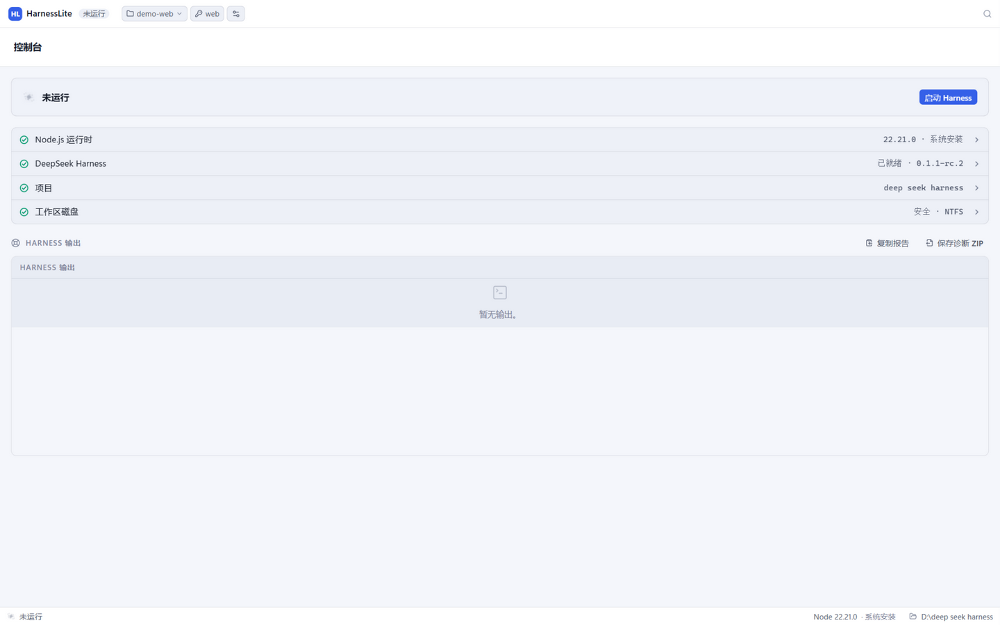
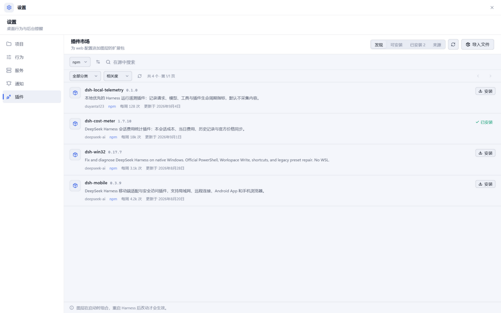
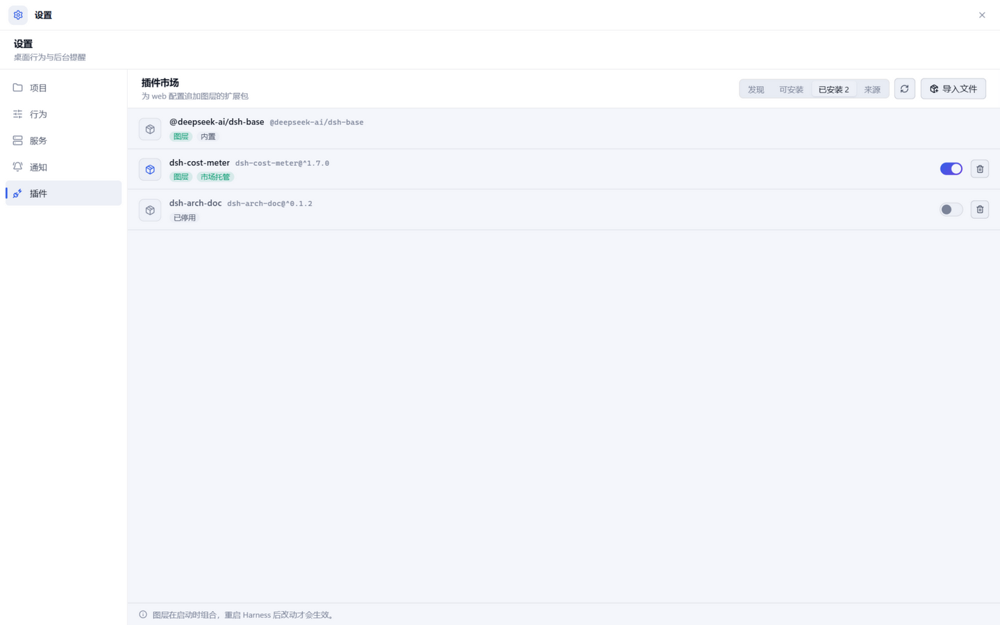
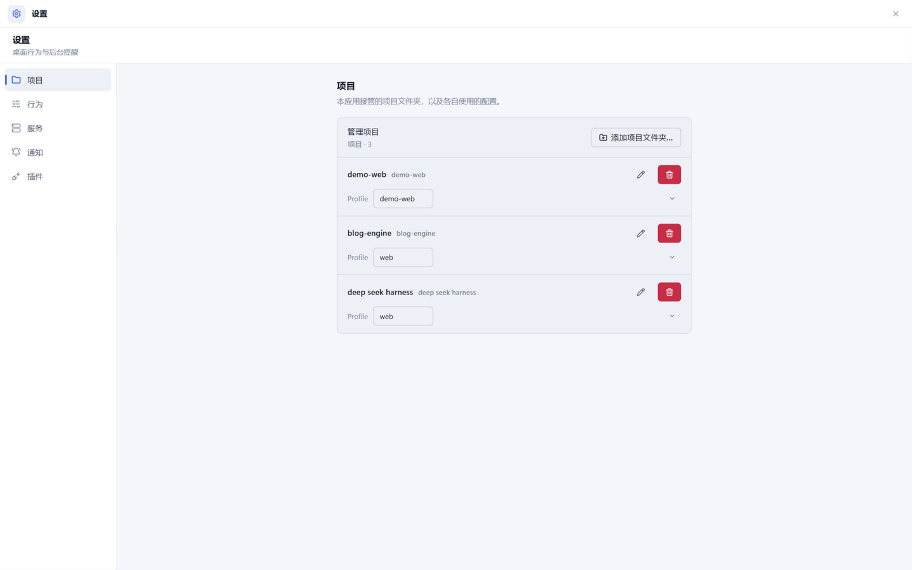
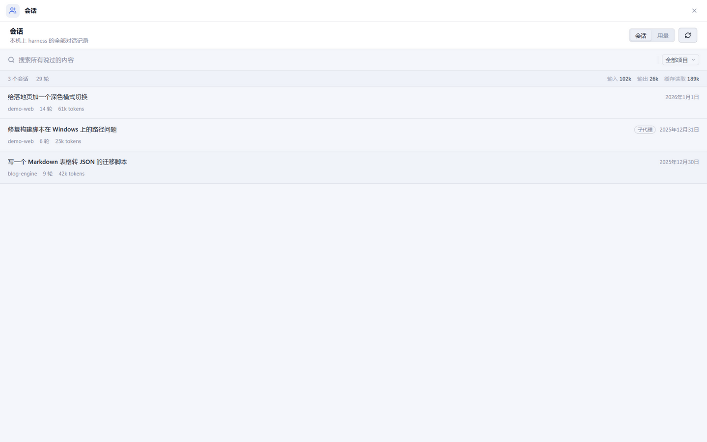
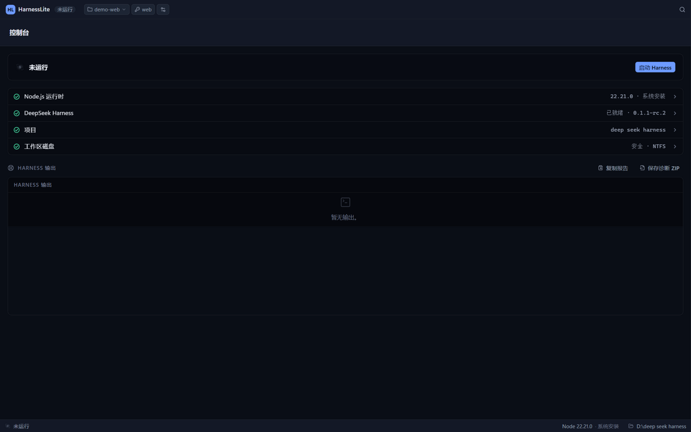

# HarnessLite

<p align="center">
  <a href="https://duyanta123.github.io/harnesslite/">下载页 · Download page</a> ·
  <a href="#-快速开始-quick-start">快速开始 · Quick start</a> ·
  <a href="#-功能一览--feature-tour">功能 · Features</a> ·
  <a href="https://github.com/duyanta123/harnesslite/releases">Releases</a>
</p>

**HarnessLite** 是 DeepSeek Harness 官方 web 界面（`dsh web`）的 **Windows 原生桌面壳**：双击启动，自动安装并托管官方 `@deepseek-ai/dsh` 运行时，在桌面窗口内呈现官方 web UI，并自带项目管理、Profile 管理、插件市场、内置终端、会话库、远程访问等完整管理面。中文界面，零命令行，对新手友好。

**HarnessLite** is a native Windows desktop shell for the DeepSeek Harness. One double-click: the shell installs and supervises the official `@deepseek-ai/dsh` web service locally, embeds its UI in a desktop window, and adds a full management plane — projects, profiles, a plugin market, a real terminal, the session library and LAN remote access.

> HarnessLite is an independent community project and is not affiliated with DeepSeek.



## ⬇ 下载 / Download

从 [GitHub Pages 下载页](https://duyanta123.github.io/harnesslite/) 或 [最新版 Release](https://github.com/duyanta123/harnesslite/releases/latest) 获取（Release 页提供两种包，链接永久指向最新版）：

| 文件 | 说明 |
|---|---|
| `HarnessLite_<版本>_x64-setup.exe` | NSIS 安装包（推荐） |
| `harnesslite.exe` | 免安装绿色版 |

- **系统要求**：Windows 10/11 x64。运行时由应用自动安装，发布版已内置 Node，无 Node 的机器开箱即用
- **首次运行**需联网安装 Harness 运行时（一次 npm 安装，约几分钟），之后离线可用
- 安装包未做代码签名，SmartScreen 首次提示时选 **更多信息 → 仍要运行**
- 已安装旧版会通过**内置自动更新**收到新版本推送

## ✨ 功能一览 / Feature tour

**运行时全自动 · Zero-setup runtime**
首次运行自动获取 Node LTS（官方源 / npmmirror 镜像）并安装锁定的 `@deepseek-ai/dsh`：staging → 原子晋升 → 备份回滚的就绪事务；崩溃恢复自动进行。环境检查面板随时告诉你这台机器还缺什么。



**插件市场 · Plugin market**
直连 npm 全量注册表（另有 awesome-dsh、DSH 1024Store 等收录目录与自定义源）。**按包名搜索精确命中**——新发布的零下载包也能被找到；安装前走 npm 隔离预检与确认对话框，可一键停用/恢复（运行时 patch，无需卸载），一键检查更新。



**项目管理 · Projects**
一个本地文件夹一个项目，各自绑定独立 Profile（凭据与插件隔离），路径安全校验拒绝网络盘/可移动盘，切换项目一键重启。



**会话库 · Session library**
直读本机 `~/.dsh/sessions`（Zstd JSONL）：全文搜索、按项目筛选、导出 Markdown/HTML/JSON，每条会话的 Token 用量与费用一目了然。



**还有 / Also on board**

- 🌓 深浅主题（跟随系统或手动）、中英双语
- 🌐 远程访问：局域网内手机扫码配对，一次性配对码、按设备吊销凭据
- ⌨️ 内置终端：ConPTY 真终端多标签，`dsh`/git/npm 环境自动配好
- 🔔 托盘常驻、全局快捷键（Ctrl+Shift+D 唤出）、自启动、任务完成通知
- 🔍 `Ctrl+K` 命令面板、诊断报告一键导出（脱敏）



## 🚀 快速开始 / Quick start

1. **下载安装** [最新版安装包](https://github.com/duyanta123/harnesslite/releases/latest)（SmartScreen 提示见上）
2. **点「启动 Harness」** —— 首次会自动装运行时，环境检查全绿即就绪
3. **开始对话** —— 官方 Harness 界面直接出现在窗口里

## 🛠 开发 / Development

```powershell
pnpm install
pnpm dev              # Vite dev server only (browser check)
pnpm tauri dev        # full desktop shell
pnpm test             # vitest
pnpm tauri build      # NSIS installer
cargo test --manifest-path src-tauri/Cargo.toml --workspace
```

架构：React 19 + Zustand + Tailwind 4 前端；薄 Tauri 命令层；Rust 分层 `hd-core`（纯数据域）与 `hd-runtime`（进程/网络生命周期）+ `proc-guard` / `node-runtime`。集成合同（env 变量、桥协议、注入包）收敛在 `hd-core::contract` 单点。发布构建把 Node 运行时打进安装包（`scripts/prepare-runtime.mjs` + `tauri.full.conf.json`），无 Node 的机器开箱即用。

**网络受限环境**：如果 npm / nodejs.org 不可直连，在启动应用**之前**为本机配置代理环境变量（把 `<proxy-host>:<proxy-port>` 换成你自己的代理地址与端口——每台电脑不一样，常见形态如本机代理软件提供的 `127.0.0.1:7890`）：

```powershell
$env:HTTP_PROXY="http://<proxy-host>:<proxy-port>"
$env:HTTPS_PROXY="http://<proxy-host>:<proxy-port>"
```

运行时下载也支持 npmmirror 镜像源加速，无需额外配置。

## License

MIT — see [LICENSE](LICENSE). Portions of the build/packaging infrastructure are derived from dsh-studio (MIT).
